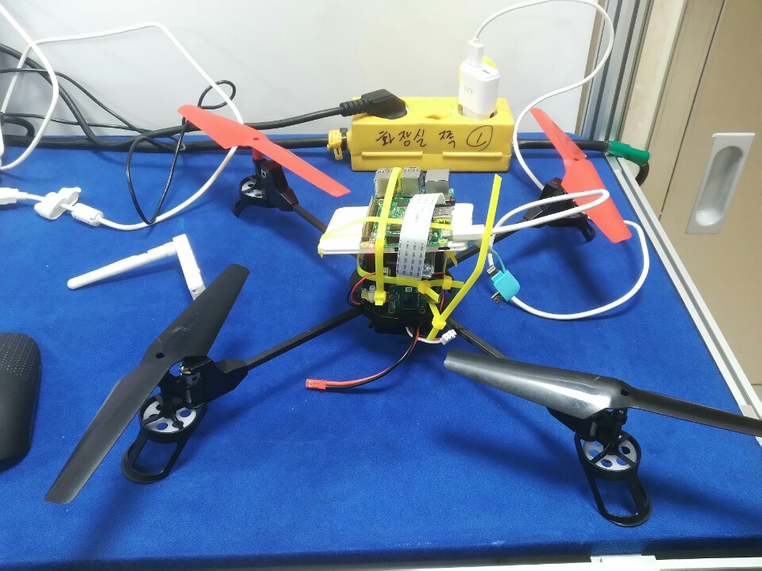

# raspberrypi_drone
2017 광운대학교 컴퓨터공학과 졸업작품 전시회 "라즈베리파이 파이캠을 활용한  영상촬영 드론"

####

##  프로젝트 개요
* 공연 촬영 시에, 정면으로 보았을 때, 좋은 뷰가 있고, 위에서 봤을 때, 좋은 뷰가 있습니다. 드론을 이용하면, 위에서 부터 정면까지 다양한 각도에서 사진 및 영상 촬영이 가능합니다.

* 해당 드론은 크게 라즈베리파이 안에서 django로 구성된 서버를 중심으로, 파이캠, 이를 동작시키는 클라이언트(웹), 그리고 드론 파트로 나누어져 있습니다.

## 기능 설명

1. 사진 촬영
웹 클라이언트 버튼 클릭 -> POST방식으로 해당하는 value 값인 picture 전송 -> 라즈베리파이 django 서버에서 value 값을 인지 하고, 해당하는 함수 호출

make_folder_pictures() -> 날짜에 맞게 폴더를 생성하고, 그 폴더 안에 찍은 사진들을 cnt 순으로 저장한다.

2. 동영상 촬영
웹 클라이언트 버튼 클릭 -> POST방식으로 해당하는 value 값인 record 전송 -> 라즈베리파이 django 서버에서 value 값을 인지 하고, 해당하는 함수 호출

make_folder_recording() -> 날짜에 맞게 폴더를 생성하고, 그 폴더 안에 찍은 영상들을 cnt 순으로 저장한다.

3. 스트리밍
Gstreamer 프레임워크를 사용하였고,
마찬가지로, POST 방식으로 해당하는 value 값인 stream을 받았을 때, go_stream() 이라는 함수를 호출하고, Server 쪽 stream.sh 쉘코드를 실행하며, 클라이언트 쪽에서는 해당 하는 batch 파일을 열어줌으로써, 스트리밍 화면을 확인할 수 있다.

4. 구글 드라이브 업로드
미리 세팅해놓은 본인의 구글드라이브 계정으로, 사진 및 영상을 업로드 하게한다.
upload라는 value 값을 받았을 때,
라즈베리파이 서버쪽에서 upload.py 파일을 실행함으로써, 파일들을 업로드 한다.

<iframe width="854" height="480" src="https://www.youtube.com/embed/PQu-4l1RaIQ" frameborder="0" gesture="media" allowfullscreen></iframe>

YouTube Demo 영상 : https://youtu.be/PQu-4l1RaIQ

